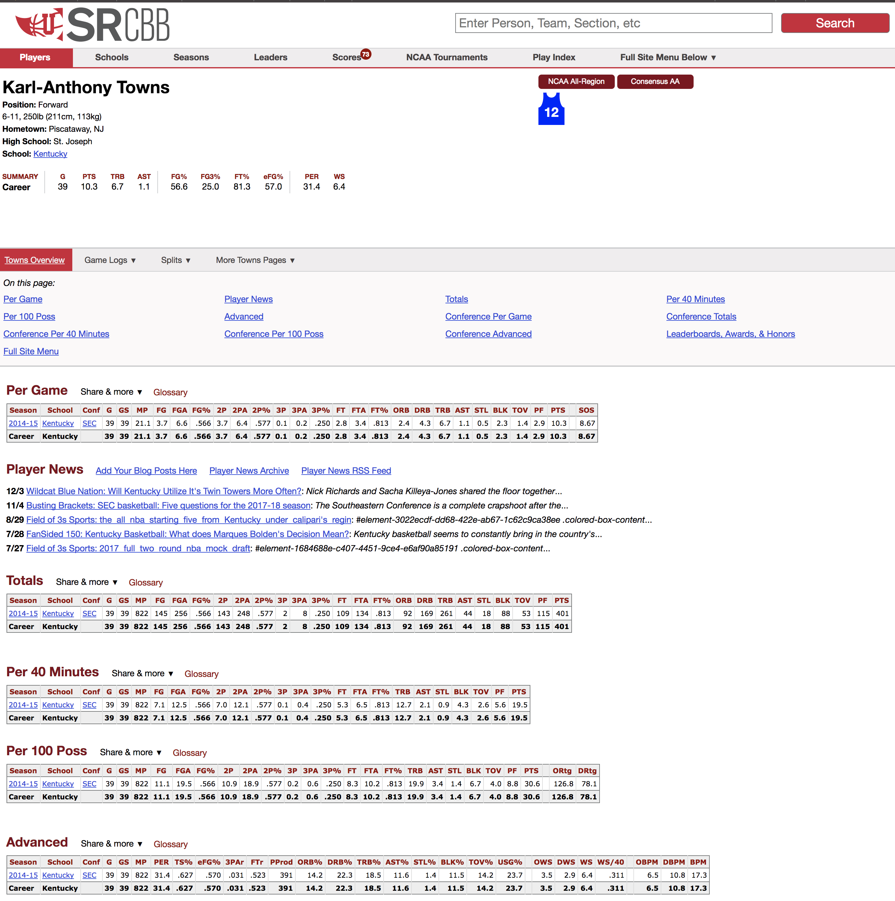
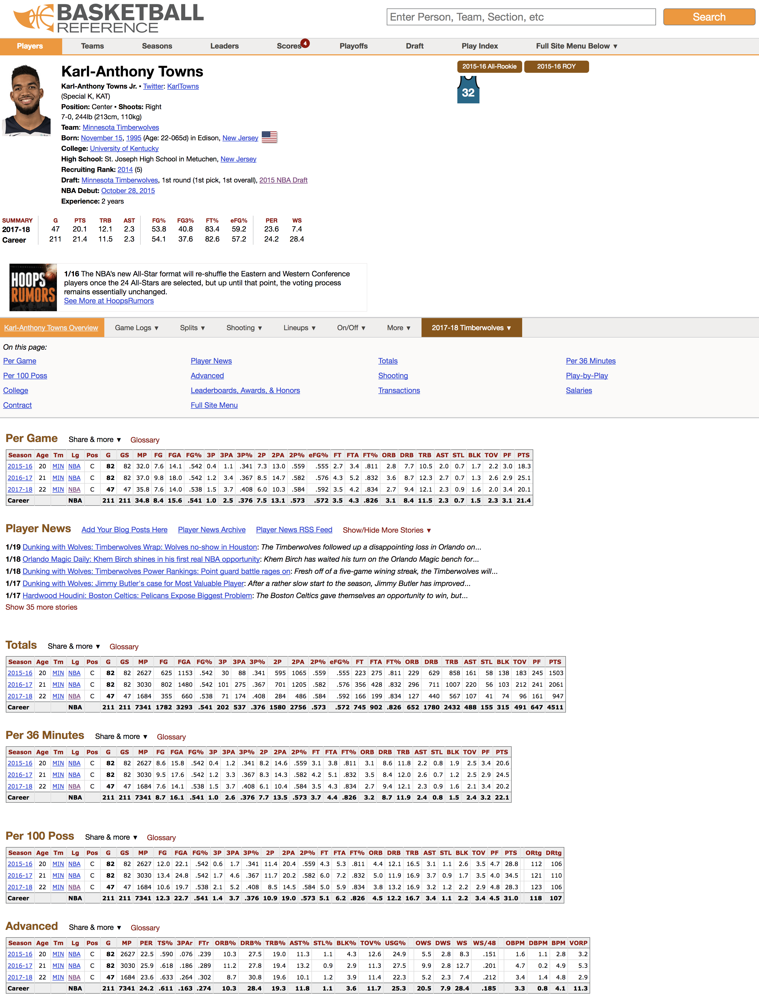

# Web Scraping Basketball-Reference.com

### Problem
The family of [Sports-Reference.com](https://www.sports-reference.com/) websites are a tremendous resource for NBA and NCAA data. They offer useful tutorials ([here](https://www.youtube.com/watch?v=MWapXbaWs_U) and [here](https://www.youtube.com/watch?v=JkDLV0roT14&t=62s)) on how to aquire that data. Others, including current primary developer/maintainer of pandas, Jeff Reback, have provided even more detailed [tutorials](https://youtu.be/2RW9zSQF1Sk). However, there exists one major inconvenience that I've only seen referenced once on [stackoverflow](https://stackoverflow.com/questions/41335992/python-crawl-table-elements). Only the first table on each player page can be easily scraped.

In the example player page below, there exists multiple tables (i.e. per-game, per-40 minutes, and per-100 possession stats).

Using examples outlined in the previously mentioned tutorials, one would hope to scrape the 'Per 100 Possession' table using the following code:
~~~
import pandas as pd
url = """https://www.sports-reference.com/cbb/players/karl-anthony-towns-1.ht
ml#players_per_poss::none"""
table = pd.read_html(url)[0]
~~~
However, that code, even though it's using the correct per_100_possession html link, will return stats from the first table on the page, the Per Game table. After inspecting the html of the entire page, it becomes clear that only the first table on the page is included in the page html. The html for subsequent tables exists only in html comments and is somehow extracted before being rendered. Thus, when one attempts to scrape those tables, they instead only scrape stats from the first table.

### Solution
To solve this problem, we need to make use of the requests and BeautifulSoup libraries. In the example below, I've created a function, which takes in a .csv with player names and the Sports-Reference url alias and returns a pandas DataFrame of each player's Per 100 Possession stats from their most-recent NCAA season. An example of the .csv is included below.

~~~
first_name,last_name,bball_ref_name,sports_ref_name
karl-anthony,towns,townska01,karl-anthony-towns-1
dangelo,russell,russeda01,dangelo-russell-1
jahlil,okafor,okafoja01,jahlil-okafor-1
willie,cauley-stein,caulewi01,willie-cauley-stein-1
stanley,johnson,johnsst04,stanley-johnson-1
~~~

The full solution:
~~~
import numpy as np
import pandas as pd
import requests
from time import sleep
from bs4 import BeautifulSoup

def college_per100(college_names):
    # Create empty pandas DataFrame
    per100 = pd.DataFrame()
    # Iterate through .csv file containing player name and Sports-Reference url alias
    for index, row in college_names.iterrows():
        # Randomly delay request to avoid being throttled
        sleep(np.random.normal(3))
        # Use string formatting to create correct link to player page
        url = """https://www.sports-reference.com/cbb/players/{0}.html# /
            players_per_poss::none""".format(row['sports_ref_name'])
        # Extract html from player page
        html = requests.get(url).text
        # Create soup object from html
        soup = BeautifulSoup(html, 'html.parser')
        # Extract placeholder classes
        placeholders = soup.find_all('div', {'class': 'placeholder'})
        for x in placeholders:
            # Get elements after placeholder and combine into one string
            comment = ''.join(x.next_siblings)
            # Parse comment back into soup object
            soup_comment = BeautifulSoup(comment, 'html.parser')
            # Extract correct table from soup object using 'id' attribute
            tables = soup_comment.find_all('table', attrs={"id":"players_per_poss"})
            # Iterate tables
            for tag in tables:
                # Turn table from html to pandas DataFrame
                df = pd.read_html(tag.prettify())[0]
                # Extract a player's stats from their most recent college season
                table = df.iloc[-2, :]
                # Add individual player stats to full per_poss DataFrame
                per100 = per100.append(table).reset_index()
                # Filter out irrelevant columns
                per100 = per100[['Season', 'School', 'Conf', 'G', 'GS', 'MP',
                'FG', 'FGA', 'FG%', '2P', '2PA', '2P%', '3P', '3PA', '3P%', 'FT',
                'FTA', 'FT%', 'TRB', 'AST', 'STL', 'BLK', 'TOV', 'PF', 'PTS',
                'ORtg', 'DRtg']]

    return per100    
~~~

The same can be done for NBA stats on Basketball-Reference.com as the page html is identical.

This time we'll scrape the Advanced stats table:

~~~
import numpy as np
import pandas as pd
import requests
from time import sleep
from bs4 import BeautifulSoup

def nba_advance(college_names):
    # Create empty pandas DataFrame
    advance = pd.DataFrame()
    # Iterate through .csv file containing player name and Sports-Reference url alias
    for index, row in college_names.iterrows():
        # Randomly delay request to avoid being throttled
        sleep(np.random.normal(3))
        # Use string formatting to create correct link to player page
        url = """https://www.basketball-reference.com/players/{0}/{1}.html#advanced /
        ::none""".format(row['bball_ref_name'][0], row['bball_ref_name'])
        # Extract html from player page
        html = requests.get(url).text
        # Create soup object from html
        soup = BeautifulSoup(html, 'html.parser')
        # Extract placeholder classes
        placeholders = soup.find_all('div', {'class': 'placeholder'})
        for x in placeholders:
            # Get elements after placeholder and combine into one string
            comment = ''.join(x.next_siblings)
            # Parse comment back into soup object
            soup_comment = BeautifulSoup(comment, 'html.parser')
            # Extract correct table from soup object using 'id' attribute
            tables = soup_comment.find_all('table', attrs={"id":"advanced"})
            # Iterate tables
            for tag in tables:
                # Turn table from html to pandas DataFrame
                df = pd.read_html(tag.prettify())[0]
                # Extract a player's stats from most recent NBA Season
                table = df.iloc[-2, :]
                # Add individual player stats to full per_poss DataFrame
                advance = advance.append(table).reset_index()
                # Filter out irrelevant columns
                advance = advance[['Season', 'Age', 'Tm', 'Pos', 'G',
                 'MP', 'TS%', '3PAr', 'FTr', 'ORB%', 'DRB%', 'TRB%',
                  'AST%', 'STL%', 'BLK%', 'TOV%', 'USG%', 'OWS',
                   'DWS', 'WS', 'WS/48', 'OBPM', 'DBPM', 'BPM', 'VORP']]

    return advance  
~~~
